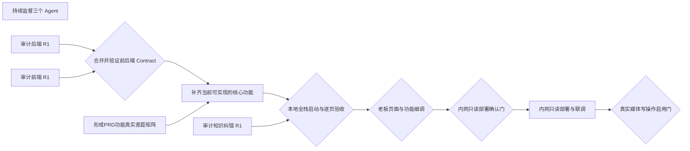

# KA投放经营平台前后端同步与本地验收

> 前后端 Contract 对齐并完成集成，使已设计且当前可实现的核心功能能在本机启动、逐页查看和验证；老板细调后进入内网只读部署联调

- 图状态：`active`
- 更新时间：`2026-08-24T12:01:39+00:00`

## 工作图

依赖：audit-backend-r1 → contract-merge；audit-frontend-r1 → contract-merge；contract-merge → feature-completion；prd-gap-matrix → feature-completion；feature-completion → local-e2e；audit-knowledge-r1 → local-e2e；local-e2e → boss-tuning-gate；boss-tuning-gate → intranet-gate；intranet-gate → intranet-deploy；intranet-deploy → write-enable-gate

## 节点

| ID | 任务 | 类型 | 状态 | 风险 | 执行者 | 依赖 | 交付物 |
|---|---|---|---|---|---|---|---|
| supervise | 持续监督三个 Agent | task | 进行中 | low | root | — | .workgraph/RUNNING_NOTES.md |
| audit-backend-r1 | 审计后端 R1 | task | 进行中 | medium | root | — | 后端SHA审计与测试证据 |
| audit-frontend-r1 | 审计前端 R1 | task | 进行中 | medium | root | — | 前端SHA审计与浏览器证据 |
| audit-knowledge-r1 | 审计知识纠错 R1 | task | 进行中 | low | root | — | 知识纠错SHA审计证据 |
| prd-gap-matrix | 形成PRD功能真实差距矩阵 | task | 进行中 | low | root | — | current/partial/gap功能矩阵 |
| contract-merge | 合并并验证前后端 Contract | merge | 待开始 | medium | root | audit-backend-r1, audit-frontend-r1 | integration-control中的可测试集成 |
| feature-completion | 补齐当前可实现的核心功能 | task | 待开始 | medium | frontend-backend | contract-merge, prd-gap-matrix | 本机可查看的核心页面与API |
| local-e2e | 本地全栈启动与逐页验收 | merge | 待开始 | medium | root | feature-completion, audit-knowledge-r1 | 本地URL、截图、E2E与缺口清单 |
| boss-tuning-gate | 老板页面与功能细调 | gate | 待开始 | medium | boss | local-e2e | 老板确认的调整批次 |
| intranet-gate | 内网只读部署确认门 | gate | 待开始 | high | boss | boss-tuning-gate | 内网部署明确批准 |
| intranet-deploy | 内网只读部署与联调 | task | 待开始 | high | root | intranet-gate | 内网地址、部署证据、运行验证 |
| write-enable-gate | 真实媒体写操作启用门 | gate | 待开始 | high | boss | intranet-deploy | 写操作单独批准 |

## 下一步

当前可执行节点：**无**
