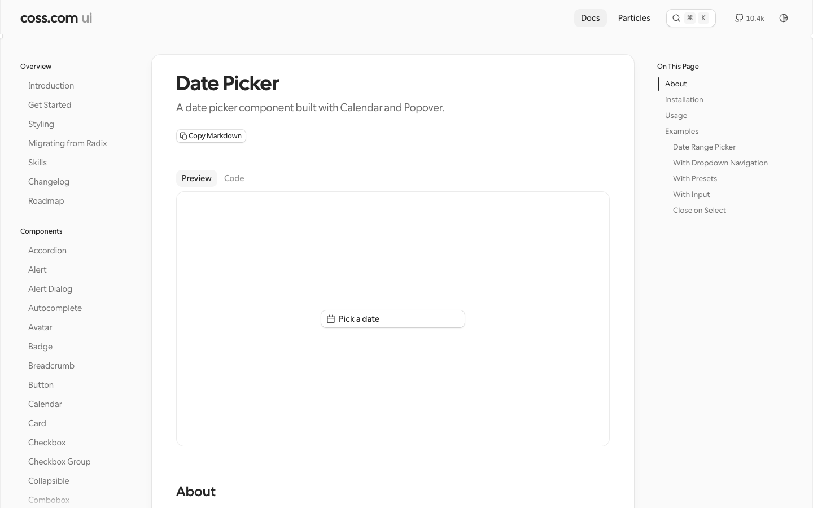
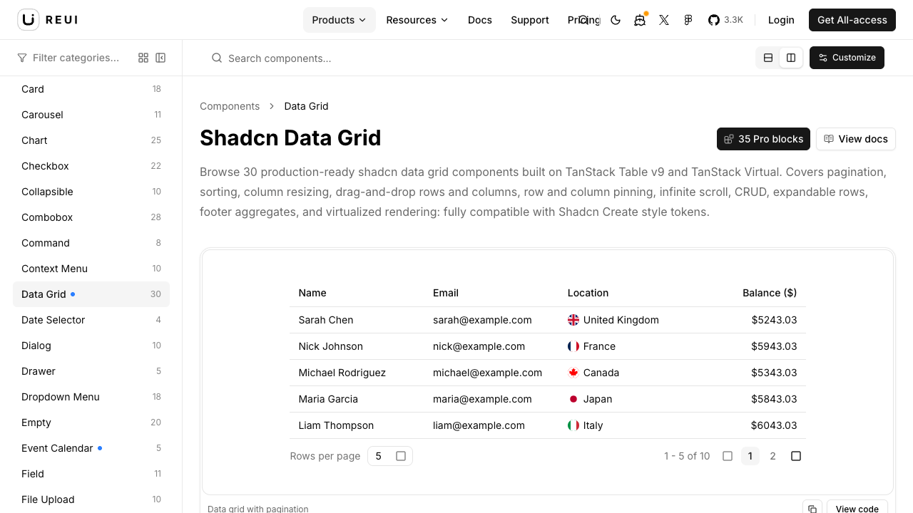
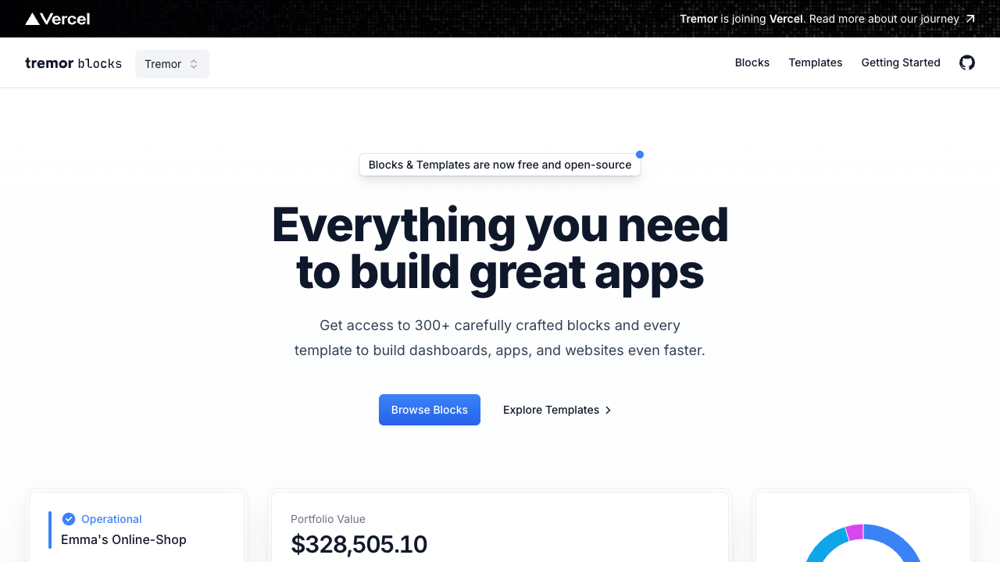
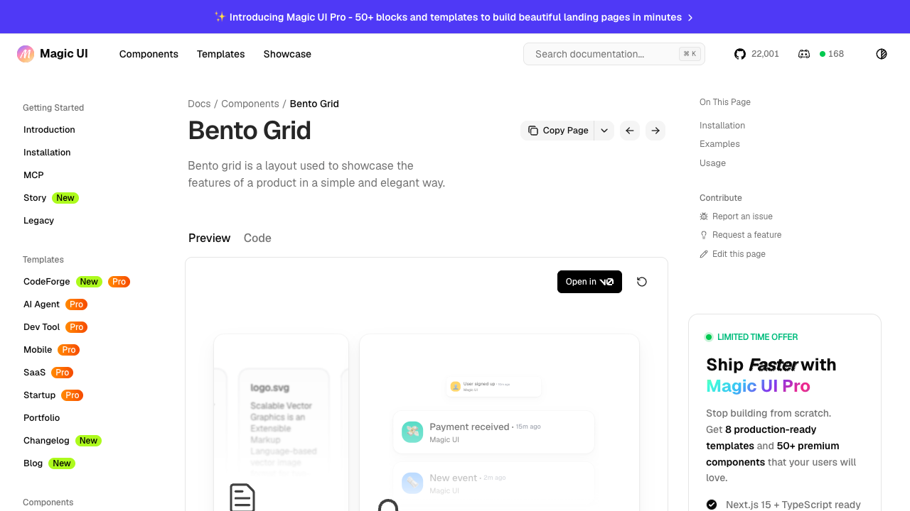
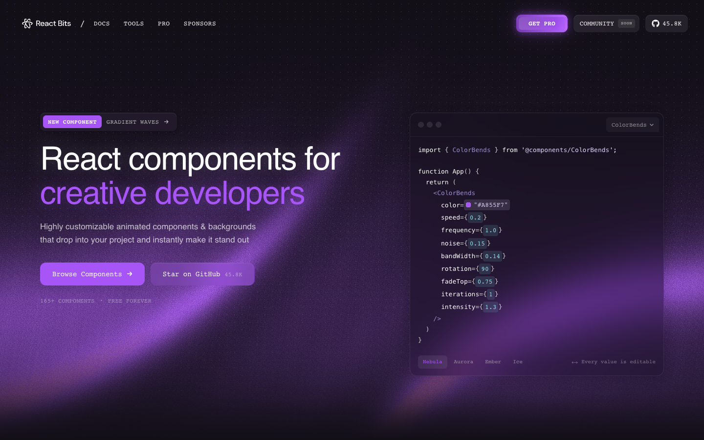
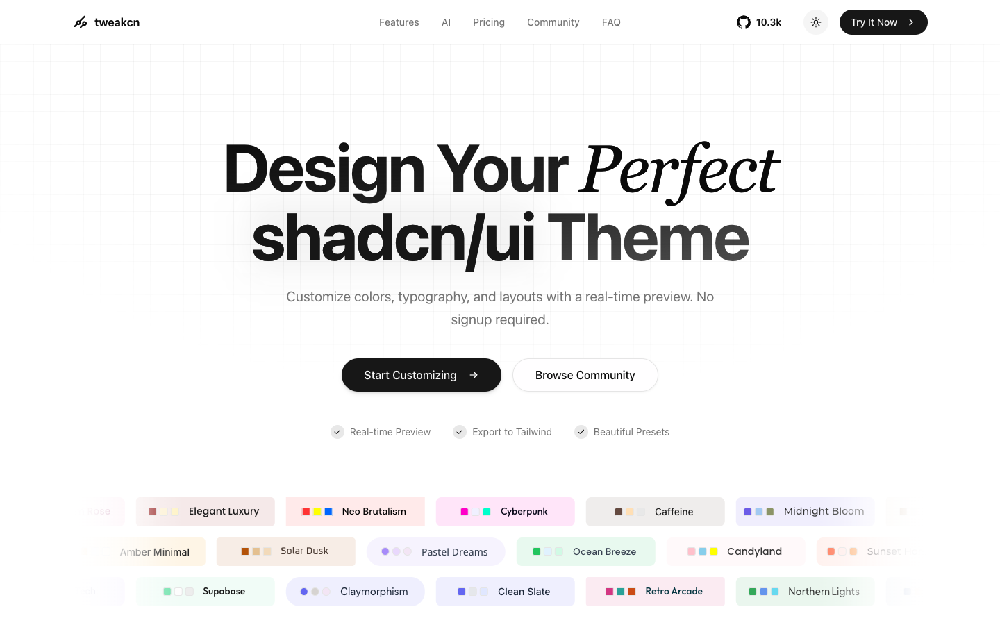

# UI 资产真实风格图册

> 截图日期：2026-08-19；截图是官网当日快照，不是运行仓实现，也不代表已购 Pro。选组件仍以 `catalogs/`、`guides/` 和官方实时预览为准。

## 一眼怎么选

| 来源 | 真实风格判断 | 适合投放 Agent | 不宜直接照搬 |
|---|---|---|---|
| shadcn/ui | 中性、克制、结构完整，像成熟 B 端产品底座 | 全站壳、Sidebar、基础表单与弹层 | 把默认样式当最终品牌视觉 |
| coss/ui | 极简、细密、控件比例好，尤其适合工具型产品细节 | 日期、筛选、Command、Field、Drawer、空态等高频细节 | 与 shadcn 同名 primitive 混装、覆盖 `components/ui/` |
| ReUI | 数据密集、企业后台感强，复杂交互现成度高 | Data Grid、复合筛选、列配置、虚拟滚动 | 为一个简单按钮引入整套复杂模式 |
| Tremor | SaaS/金融驾驶舱感，指标卡和报告节奏成熟 | KPI、趋势、日报、管理驾驶舱版式 | 再引入一套图表运行时；项目图表仍统一 ECharts |
| Aceternity UI | 高级、戏剧化、空间和光效明显 | Agent 欢迎区、关键空态、少量高级展示 | 大面积铺到高频数据操作页 |
| Magic UI | 明亮、圆润、Bento 和轻动效完成度高 | 功能总览、成果陈列、局部高光卡片 | 每张业务卡都加动效 |
| React Bits | 创意、强动效、辨识度高 | 登录/欢迎、AI 能力入口、少数背景和文字动效 | 表格、长列表和全天候操作区 |
| tweakcn | 不是单一组件风格，而是 shadcn 主题编辑器与预设集合 | 运行时多风格切换、主题展厅、token 导出 | 把社区主题对象直接当稳定业务契约 |

## coss/ui：细节控件优先

- 视觉：黑白中性、留白清楚、控件窄而精细，和数据工具的高频筛选区很匹配。
- 使用：先查 Components 和 500+ Particles；有官方 Particle 就复制源码适配，不重新手写同类组合。
- 工程边界：Base UI 单独放来源隔离目录，不能覆盖当前 shadcn/Radix primitives。
- 官方入口：[Components](https://coss.com/ui/docs)、[Particles](https://coss.com/ui/particles)。

## ReUI：复杂数据交互优先

- 视觉：清爽的现代 B 端，信息密度高但层级稳定；比普通 shadcn Table 更接近成品数据产品。
- 使用：Data Grid、Filters、列拖拽/固定、虚拟化、Kanban、Gantt 等复杂能力先查这里。
- 工程边界：先 inspect 具体 Registry style 和 TanStack 依赖；只拿需求命中的 pattern。
- 官方入口：[Components](https://reui.io/components)、[Data Grid](https://reui.io/components/data-grid)。

## Tremor：KPI 与报告版式优先

- 视觉：典型现代 SaaS/金融看板，标题、指标卡、趋势区的比例成熟。
- 使用：优先借 Blocks 的布局、指标卡和报告节奏；业务图表替换成项目统一的 ECharts。
- 工程边界：Components 与 Blocks 分属不同官方仓库和许可证，复制前看对应 guide。
- 官方入口：[Blocks](https://blocks.tremor.so/blocks)、[Templates](https://blocks.tremor.so/templates)、[Docs](https://www.tremor.so/docs)。

## Magic UI：Bento 与轻动效

- 视觉：柔和、精致、偏产品展示；Bento 卡片适合解释能力而不是承载主操作流。
- 使用：AI 能力总览、提效成果、功能入口可局部采用。
- 工程边界：统一接项目 token，补 `prefers-reduced-motion`，避免持续动画干扰数据阅读。
- 官方入口：[Free Components](https://magicui.design/docs/components)、[Pro Preview](https://pro.magicui.design/)；Pro 目录只有公开下限，不代表已购买。

## React Bits：偶尔使用的强视觉动效

- 视觉：强烈、创意、偏暗色科技感；好看，但不适合作为整套后台基础视觉。
- 使用：只在欢迎页、Agent 入口、空态或背景中少量使用；选择 TS + Tailwind 变体。
- 工程边界：逐项看动画依赖和性能；免费源码遵守 MIT + Commons Clause，Pro 另算。
- 官方入口：[React Bits Free](https://reactbits.dev/)、[React Bits Pro](https://pro.reactbits.dev/)；Pro 名称可查，源码需对应 license key。

## tweakcn：多风格运行时核心

- 视觉：同一 shadcn 结构可切换 Modern Minimal、Caffeine、Claymorphism、Clean Slate 等不同气质。
- 使用：已收录 42 个官方 `defaultPresets`；后续做主题展厅和运行时切换时，从这里选种子主题。
- 工程边界：最终持久化项目自己的语义 token 与版本号；社区动态主题只作候选，不冒充完整稳定 API。
- 官方入口：[Theme Editor](https://tweakcn.com/editor/theme)。

## Aceternity UI：高级展示与空间动效

- 风格：层次、渐变、光效和交互动势最强，适合制造“AI Native”第一印象。
- 使用：欢迎区、关键成果卡、少量空态或说明页；高频操作页保持克制。
- 工程边界：免费与 Pro 分开，逐项核许可证；Pro 源码不可作为组件库再分发。
- 官方入口：[Components](https://ui.aceternity.com/components)、[完整 AI 目录](https://ui.aceternity.com/ai-recommendations)。
