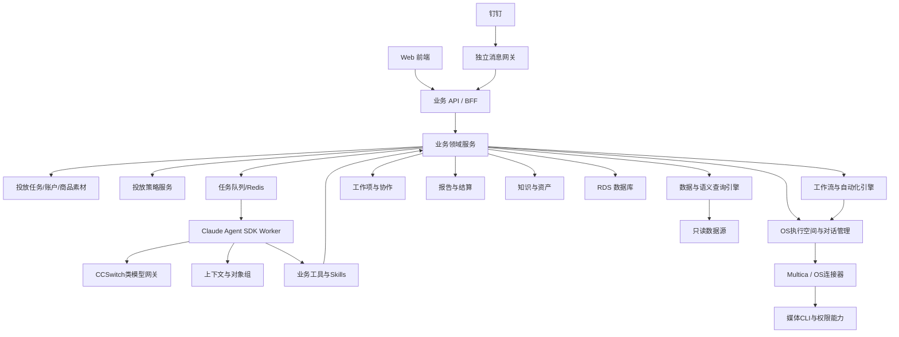

# KA 投放经营平台·讨论版 v0.4

> 日期：2026-08-14  
> 状态：目标设计，尚未实现，用于继续与 Claude、Codex 讨论。  
> 重要说明：**本版不确定一级导航、不确定左侧菜单结构，也不把能力模块编号等同于页面层级。**先把产品对象、业务能力、运行逻辑和技术边界讨论清楚，完整页面信息架构与跳转关系后续单独设计。  
> 数据声明：文档中的账户、任务、金额、人员和指标示例均须使用虚构脱敏信息。
> 2026-08-17 增补：加入 OS 执行空间、Multica 对话托管、结构化基建指令和提示词兜底设计；仍不代表已经获得新 OS 全量会话接口。

# 一、产品定位

它不是单纯的数据看板、CLI 套壳、聊天机器人、工作流画布或待办系统，而是：

> 面向 KA 部门的投放经营与自动化平台。以投放任务为主线，把数据、账户、商品素材、投放策略、工作流执行、协作、报告结算和知识沉淀串成完整闭环。

核心价值：

- 优化师少做重复查数、透视、逐户排查、基建和报表；
- 运营能按投放任务管理目标、差距、账户、商品素材和运行进度；
- KA 负责人能掌握整体经营、业务风险、资源配置和策略效果；
- 更高层能看到目标结果、重大问题和 AI 提效；
- 将个人经验沉淀成可复用的指标、报表、投放策略、工作流和知识案例；
- 把“发现问题—分析判断—执行动作—效果回收”真正闭环，而不只是生成建议。

产品的核心壁垒不是聊天，也不是拖拽画布，而是：

```text
投放业务语义
+ 统一数据口径
+ 任务和资源关系
+ 投放策略沉淀
+ 可靠工作流执行
+ 权限与审计
+ 操作效果回收
```

# 二、核心业务模型

平台最核心的经营对象是“投放任务”，不是单个账户，也不是一次 Agent 对话。

```text
投放任务
├── 基础信息
│   ├── task_id、业务类型、渠道、RTA
│   ├── 考核价、出价方式、转化口径
│   └── 周期、预算、跑量目标、负责人
│
├── 投放资源
│   ├── 账户
│   ├── 商品
│   ├── 素材
│   └── 广告对象
│
├── 投放打法
│   └── 投放策略
│       ├── 版位与投放方式
│       ├── 出价、RTA和预算节奏
│       ├── 账户结构
│       ├── 商品与素材组合
│       └── 冷启动、起量、稳定和衰退阶段打法
│
├── 执行体系
│   ├── 工作流
│   ├── 自动化规则
│   ├── 工作流运行实例
│   ├── Agent任务
│   ├── OS执行空间
│   │   ├── 账户与主对话绑定
│   │   ├── 历史对话
│   │   ├── Skill和基建模板
│   │   └── 定时基建配置
│   ├── 结构化指令请求
│   └── Multica执行任务与结果
│
├── 经营结果
│   ├── 数据指标
│   ├── 异常与机会
│   ├── 工作项与操作
│   ├── 变更集
│   └── 效果回收
│
└── 业务产物
    ├── 报告
    ├── 结算单
    └── 知识与案例
```

需要明确区分：

- **投放任务**：长期经营对象，承载目标、资源、打法、执行和结果。
- **投放策略**：这类任务应该怎么投，回答版位、投法、RTA、出价、预算、账户和商品素材组合问题。
- **工作流**：具体动作如何连续完成，是一套可重复、可暂停、可恢复、可审计的执行编排。
- **自动化规则**：什么时候、针对哪些对象、在什么边界下触发哪个已发布工作流。
- **SOP**：工作流在业务侧的阶段视图；开户到监控是一条长工作流，不是另一套引擎。
- **工作项/待办**：某个人当前需要处理的一件事。
- **运行实例**：工作流的一次真实执行，固定版本、输入、执行身份和状态。
- **变更集**：媒体写操作具体改哪些对象、从什么值改到什么值。
- **OS执行空间**：某个账户在平台中的 OS 执行上下文，保存主对话、历史对话、可用 Skill、基建模板、定时配置和最近运行状态；它是管理关系，不是另一套 Agent。
- **OS对话绑定**：账户与 Multica issue/对话之间的关联。一个账户可以保留多段历史对话，但同一时间只设置一个主要基建对话。
- **结构化指令请求**：由表单参数和模板编译出的可审计请求，保存参数 Schema、模板版本、最终提示词、发送状态和执行关联 ID。

# 三、产品能力地图

本节只描述平台必须具备的能力域，**不代表一级导航、菜单顺序或页面数量**。

```text
KA 投放经营平台能力地图
├── 经营洞察与角色工作区
├── 投放任务管理
├── 数据与自助分析
├── 投放策略
├── 账户资源
├── OS基建与对话管理
├── 商品与素材
├── 自动化与可靠执行
├── 工作项与协作
├── 报告与结算
├── 知识与公共资产
├── 消息与钉钉触达
├── 平台治理与系统能力
└── 全局 Agent
```

未来设计一级导航时，要根据以下因素重新组合，而不是直接照搬这张能力地图：

- 不同角色的高频任务；
- 优化师每天的真实工作路径；
- 任务详情能够承载多少上下文功能；
- 普通使用与高级创作如何分层；
- 哪些能力应该是页面，哪些应该是抽屉、页签、快捷入口或后台能力。

# 四、功能设计

## 1. 经营洞察与角色工作区

产品入口是可视化经营工作区，不是聊天框。但不同角色的默认工作区不必完全相同。

公共能力包括：

- 消耗、转化、实际成本、考核价和成本空间；
- 目标完成率、跑量进度和预算进度；
- 任务与账户健康；
- 风险和机会；
- 今日需要处理、确认和观察的事项；
- 正在运行的工作流和 SOP；
- 商品与素材信号；
- 最近操作效果；
- AI 经营总结；
- 查数、诊断、创建任务、生成报告等快捷动作。

角色重点：

| 角色 | 默认关注的问题 |
|---|---|
| 优化师 | 今天应该处理哪些任务、账户或素材，为什么，建议怎么做 |
| 运营 | 任务完成情况、Gap、账户商品素材准备度和协作阻塞 |
| KA负责人 | 目标差距、任务风险、预算、账户和资源配置 |
| 更高层 | 核心目标、重大风险、AI提效和需要拍板的事项 |

底层指标同源，呈现和默认动作按角色变化。不做个人效率排名，不把产品变成员工监控工具。

## 2. 投放任务管理

维护所有正在准备、正在投放和已经结束的任务。

每个任务包含：

- RTA、考核出价、预算、跑量目标和周期；
- 渠道、版位、出价方式和转化口径；
- 账户需求、已关联账户和容量；
- 商品、素材和测试组合；
- 当前采用的投放策略及版本；
- 开户、充值、基建、上线和监控工作流；
- 当前投放阶段；
- 负责人和协作人；
- 数据表现、风险和机会；
- 工作项、操作、效果回收；
- 报告和结算配置；
- 历史版本和变更记录。

任务详情需要能够查看：

```text
任务基础与目标
数据表现
账户与广告对象
商品与素材
投放策略
SOP与自动化
异常与工作项
操作和效果时间线
报告与结算
```

这些是任务详情的业务内容，不代表已经确定页面页签名称和数量。

## 3. 数据与自助分析

数据能力包括：

```text
官方经营分析
投放监控
自助探索
自助报表与看板
分析卡片/Question
个人视图/Bookmark
公共数据资产
数据集与字段字典
指标口径
数据健康
```

### 数据对象

统一定义：

```text
Entity
任务、账户、广告、商品、素材

Metric
消耗、转化、实际成本、考核价、达成率

Dimension
日期、渠道、版位、负责人、任务阶段

Segment
冷启动、超成本、低消耗、起量、稳定、衰退

Dataset View
供任务经营、账户分析、素材分析等场景使用的认证字段集合

Question/Chart
一次查询、筛选和可视化结果

Dashboard
由多个分析组件组成的经营视图

Bookmark
个人保存的筛选和分析状态
```

普通用户和 Agent 不直接连接物理表、随意 Join 或修改官方指标，而是使用经过治理的语义层。

### 官方数据集与视图

平台先提供：

- 投放任务表现；
- 账户表现；
- 广告表现；
- 商品表现；
- 素材表现；
- 策略和操作效果；
- 工作项处理效果；
- 结算数据。

### 自助分析和报表设计器

用户可以选择：

- 数据视图；
- 维度和指标；
- 时间范围；
- 筛选、分组和排序；
- 表格、透视、趋势、柱状、排名、漏斗、散点、热力和说明组件。

使用路径分层：

```text
直接使用官方分析
→ 保存个人视图
→ 复制官方报表修改
→ 高级用户进入自由设计器
```

普通用户第一次使用不面对空白画布。

### Agent 帮用户做表

用户可以说：

> 做一张近七天按投放任务和负责人分组的消耗、实际成本、考核价和跑量达成率报表，超成本标红。

Agent 生成数据视图、字段、筛选、组件和布局草稿，用户预览后应用。Agent 不自己计算官方指标。

### 数据健康

所有重要数据页面需要展示：

- 数据来源；
- 更新时间；
- 覆盖账户和缺失账户；
- 是否使用实时补洞；
- 当前指标口径版本；
- 是否可以用于策略判断或媒体写操作。

数据不新鲜、样本不足或正在补洞时，可以分析和提醒，但禁止自动进入高风险写操作。

## 4. 投放策略

投放策略负责回答：**这个任务应该怎么投。**

策略内容包括：

- 使用哪个广告版位和资源位；
- 采用什么投放方式；
- 使用什么出价和优化目标；
- RTA如何配置；
- 账户结构和账户矩阵；
- 总预算、日预算和预算节奏；
- 冷启动、起量、放量、稳定和衰退阶段打法；
- 商品和素材组合；
- 人群、时段和场景；
- 什么情况下换商品、换素材、换版位或停止；
- 相似任务和历史策略效果。

策略不是“开户—充值—基建”的动作流程，也不是“成本超过20%就触发”的自动化规则。

策略来源：

- 官方内置策略；
- 团队已验证策略；
- 个人策略；
- Agent根据历史数据生成的策略草稿。

策略需要记录：

- 适用渠道、版位和阶段；
- 适用任务、商品和素材条件；
- 不适用条件；
- 样本任务数和验证周期；
- 历史消耗、成本和跑量表现；
- 版本和可信程度；
- 被哪些任务使用；
- 使用后的真实效果。

Agent可以生成策略草稿、对比策略和解释差异，但不直接替优化师拍板。

## 5. 账户资源

统一管理账户资源：

- 新增、导入和关闭账户；
- 权限、负责人和关联任务；
- 余额、预算、消耗和容量；
- 待申请、待开户、待充值、待基建、冷启动、起量、稳定、衰退、暂停和关闭；
- 账户健康和问题账户；
- 基建队列和账户模板；
- OS执行空间、主要基建对话和历史对话；
- 对话绑定状态、可用 Skill、最近运行和连接健康；
- 结构化基建指令和提示词兜底；
- 定时基建任务、下次运行时间和历史结果；
- 账户需求预测；
- 任务与账户匹配建议；
- 账户负荷和分配；
- 操作历史和效果回收。

任务或工作流可以从账户池选择可用账户，也可以产生新增账户、充值或基建需求。

### 账户资源内的基建管理 Tab

OS 基建与对话管理不做一级导航。在账户资源内部增加独立的 **“基建管理”Tab**，与账户池并列，作为日常基建的集中入口：

```text
账户资源
├── 账户池
├── 基建管理
└── 其他账户相关视图
```

Tab 命名使用“基建管理”，不使用“OS 对话管理”。用户的业务目标是完成账户基建，OS 对话只是底层执行方式。

基建管理 Tab 统一展示：

- 待基建账户；
- 当前主要 OS 对话和绑定状态；
- 使用的 Skill 和基建模板；
- 今日计划和实际基建广告组数量；
- 定时任务及下次运行时间；
- 当前执行状态和最近运行结果；
- 失败原因和失败项重试；
- 新建基建、批量基建和配置定时任务；
- 打开原始 OS 对话。

点击账户后，通过右侧抽屉或详情视图查看：

```text
账户基础信息
主要对话
历史对话
结构化指令
定时任务
运行记录
受限原始OS日志
```

其他页面保留上下文快捷入口：账户池每行的“基建”按钮、投放任务详情的基建 SOP 阶段、我的工作中的待基建事项、自动化运行记录和钉钉卡片。所有入口都进入同一基建管理 Tab，并自动带入对应账户、任务或运行筛选，不生成另一套基建状态。

## 6. 商品与素材

定位是商品素材情报、测试和复刻承接，不是完整视频剪辑器。

包括：

- 商品池、待测试和可放量商品；
- 商品表现和选品信号；
- 素材池；
- 素材表现、生命周期和疲劳预警；
- 素材拆解和拆片；
- 钩子、卖点、人群、人物、场景、节奏和 CTA；
- 查找相似商品和素材；
- 爆量素材复刻方向；
- 复刻版本谱系；
- 商品×素材测试矩阵；
- 生成设计承接任务；
- 新商品、新素材上线后的效果回收。

## 7. 自动化与可靠执行

自动化能力包括：

```text
原子能力库
工作流设计器
官方工作流模板
团队公共工作流
个人工作流
自动化规则
运行中心
OS基建控制台
执行日志与审计
```

### 原子能力

- 数据节点：查任务、账户、广告、商品和素材；
- 计算节点：聚合、比较和确定性规则；
- Agent节点：分析、归因和生成草稿；
- 执行节点：开户、充值、基建、改价、预算、时段、上下线和素材替换；
- 协作节点：创建工作项、派发、钉钉推送和生成报告；
- 控制节点：触发、条件、等待、重试、并行和人工确认。

工作流画布只提供投放业务节点，不开放任意 HTTP、Shell、SQL、Python 或社区节点给普通用户。

### 工作流

工作流回答“具体怎么执行”。例如：

```text
读取投放任务
→ 检查账户需求
→ 开户
→ 充值
→ 基建
→ 上线检查
→ 冷启动等待
→ 跑量监控
→ 异常处理
→ 效果回收
→ 报告结算
```

用户可以：

- 使用官方模板；
- 复制模板修改；
- 创建个人工作流；
- 提交团队公共池；
- 让 Agent 生成草稿；
- 模拟运行；
- 查看运行和效果。

Agent只能生成工作流草稿，必须经过 Schema、类型、权限、确认门、参数和模拟运行校验后才能发布。

### 自动化规则

自动化规则回答：

```text
什么时候
+ 针对哪些任务或账户
+ 满足什么数据和安全条件
→ 调用哪个已发布工作流版本
```

规则页面必须解释“为什么没有触发”：

- 数据未刷新；
- 样本不足；
- 正在冷却；
- 达到每日调整上限；
- 与另一个操作冲突；
- 权限不足；
- 等待确认。

### 可靠执行

真正的工作流能力不仅是画布，还包括：

- 草稿、校验、测试、发布和激活分离；
- 运行固定在启动时的工作流版本；
- 工作流所有者、发起人、执行身份和确认人分开；
- 凭证只保存引用，不进入流程定义；
- 不同节点使用不同重试规则；
- 账户和广告对象写操作冲突锁；
- 创建类操作幂等保护；
- 人工确认是可暂停、可恢复、可过期的状态；
- Multica出现 UNKNOWN 时先对账，禁止盲目重发；
- 服务重启后恢复长任务；
- 运行后自动回查媒体状态；
- 执行前基线和执行后效果回收。

### OS 基建与对话管理

这一能力把当前不可视的“账户—OS 对话—Skill 基建—定时任务—执行结果”变成平台可管理的执行空间。入口确定为**账户资源内部独立的“基建管理”Tab**，不做一级导航；OS 对话管理是该 Tab 内的核心能力，不再单独拆一个“OS 对话”Tab。

#### 接入策略

采用 **B 为主、A 兜底**：

```text
B 平台托管
新基建从 KA 平台发起
→ 平台创建或复用自己管理的 Multica issue/对话
→ 发送结构化指令
→ 获取执行结果
→ 写入基建台账和运行记录

A 提示词兜底
Multica创建、发送或续接不可用
→ 只生成结构化提示词
→ 用户复制到 OS 人工执行
→ 平台明确标识“未发送/待人工回填”
```

平台作为 Control Plane（管理和调度层），Multica/OS 作为 Execution Plane（受保护执行层）。平台不复制 OS 的 Agent 运行时，也不持有媒体真实 Token。

#### OS 执行空间

每个账户可以关联一个 OS 执行空间：

```text
OS执行空间
├── 所属账户和投放任务
├── 当前主要基建对话
├── 历史对话
├── Workspace和Agent引用
├── 可用Skill
├── 基建模板和参数默认值
├── 定时基建配置
├── 最近一次运行
├── 下一次预计运行
└── 连接与同步健康
```

“一个账户对应一个对话”只作为一期使用习惯，不写成永久数据约束。对话过长、失效、换 Agent 或迁移后可以新建主对话，历史对话继续保留并可追溯。

平台需要支持：

- 为账户创建平台托管对话；
- 将平台创建的对话设为主要基建对话；
- 手工登记已有 OS 对话的链接或 ID；
- 更换主对话并保留历史关系；
- 查看对话对应的账户、任务、Skill、基建模板和运行记录；
- 打开原始 OS 页面；
- 查看最后同步时间、同步范围和连接状态；
- 对失联、无权限、接口不支持和状态未知做明确提示。

平台只对自己创建、发送并取得结果的请求提供完整状态。手工绑定的历史 OS 对话，如果没有读取或续接接口，只作为外部引用和人工历史入口，不能伪装成已经完整同步。

#### 结构化基建指令

用户不必手写长提示词，而是选择或填写：

- 投放任务和账户；
- 基建模板和 Skill；
- 商品、素材和组合方式；
- 广告组数量；
- 版位、投放方式和 RTA；
- 出价、预算和时段；
- 立即执行或定时执行；
- 其他模板要求的受控参数。

平台执行：

```text
选择业务对象和参数
→ Schema校验
→ Prompt Compiler生成结构化指令
→ 展示参数摘要、最终提示词和预计影响
→ 用户确认
→ 发送到主要基建对话
→ Multica调用Skill执行
→ 平台获取并解析结果
→ 更新账户、基建队列、运行记录和效果回收
```

每次请求保存：

- 参数快照；
- 模板和 Schema 版本；
- 最终提示词快照；
- 发起人、确认人和执行身份；
- 账户、任务、对话和工作流关联；
- Multica correlation/run/issue 标识；
- 创建、发送、运行、结果和对账时间；
- 结构化结果和受限原始返回。

提示词生成成功不等于已经发送，发送成功不等于执行成功。状态至少区分：

```text
草稿
已生成未发送
已排队
已发送
执行中
等待确认
成功
部分成功
失败
未知
已取消
```

#### 基建控制台

需要能够按账户、任务和日期查看：

- 是否绑定主要对话；
- 今天计划和实际基建多少广告组；
- 当前使用的 Skill、模板和参数版本；
- 定时任务是否启用以及下一次运行；
- 最近执行状态、耗时和结果；
- 失败账户、失败广告组和失败原因；
- 部分成功后的失败项重试；
- 为什么没有执行；
- 进入原始 OS 对话和受限运行记录；
- 批量生成、预览、确认、暂停和取消允许的请求。

“为什么没有执行”至少解释：

- 没有绑定主要对话；
- Multica连接失败；
- 对话无权限或已失效；
- Skill不可用或版本不匹配；
- 参数或素材不完整；
- 正在等待确认；
- 达到当日创建上限；
- 与同账户其他基建任务冲突；
- 定时任务未启用；
- 运行状态未知，正在对账。

#### 定时任务边界

产品目标是可视化维护定时基建配置、运行状态和历史结果。定时任务最终由平台调度，还是暂由 OS 对话内部定时能力执行，**当前仍待确认**。

无论采用哪种方式，都必须满足：

- 平台保存期望配置和版本；
- 创建、修改、暂停和取消都有明确回执；
- 显示下一次预计运行时间；
- 计划状态和实际状态可对账；
- 未取得 OS 确认时不得显示“配置成功”；
- 重复触发有幂等保护，同一账户基建有冲突锁。

### Shadow Mode

自动化策略在真实执行前，可以先运行一段时间的影子模式：只展示如果启用会操作哪些对象、为什么和预计影响，不实际写媒体。

## 8. 工作项与协作

统一承接：

- 系统异常；
- Agent建议；
- 上级派发；
- 自动化规则产生；
- 工作流产生；
- 用户自建。

每条工作项包含：

- 关联任务、账户、商品、素材或其他对象；
- 证据快照；
- 建议动作；
- 负责人和截止时间；
- 讨论和补充；
- 当前状态；
- 实际执行动作；
- 效果验收。

上级派发时自动携带当时的数据和分析上下文。对上层展示任务和团队阻塞，对个人展示产品提供的帮助，不做个人排名。

## 9. 报告与结算

报告包括：

- 日报、周报和月报；
- 投放任务报告；
- 渠道经营报告；
- 账户、商品和素材测试报告；
- 投放策略效果报告；
- 工作流运行和效果报告；
- AI提效报告；
- 管理层经营简报。

结算包括：

- 每期模板；
- 模板版本；
- 标准字段映射；
- 字段变化提示；
- 自动取数；
- 确定性计算；
- Agent解释字段差异；
- 人工修正留痕；
- 数据健康、校验和预览；
- 导出、推送和历史结算单。

不同期次字段变化时，新模板不能覆盖旧结算单。

## 10. 知识与公共资产

沉淀：

- 渠道 SOP；
- 指标口径；
- 诊断规则；
- 投放策略；
- 工作流；
- 基建模板；
- 商品素材经验；
- 成功和失败案例；
- 操作效果；
- 结算口径；
- 常见问题。

形成：

```text
数据
→ 异常和机会
→ 分析判断
→ 动作
→ 效果
→ 验证
→ 知识
→ 反哺策略和工作流
```

## 11. 消息与钉钉触达

提供：

- 钉钉机器人；
- 用户、任务和业务对象映射；
- 早报、异常、待办、工作流和报告推送；
- 卡片模板；
- 触发条件；
- 静默时段；
- 重试和发送记录。

钉钉支持：

- 查数据和任务；
- 创建工作项；
- 获取经营报告；
- 查看工作流进度；
- 点击互动卡片运行允许的动作；
- 对媒体写操作进行变更确认；
- 查看执行中、成功、部分成功和失败结果。

处理原则：

- 确定性查数直接查产品数据；
- 分析判断交给内置 Agent；
- 工作流状态和确认由产品管理；
- 受保护媒体操作由产品工作流调用 Multica。

卡片动作分级：

| 级别 | 示例 | 行为 |
|---|---|---|
| L0 只读 | 查数、刷新、生成报告 | 点击直接运行 |
| L1 低风险 | 创建工作项、静默告警、保存草稿 | 卡片确认后运行 |
| L2 媒体写 | 改价、改预算、暂停和基建 | 卡片展示变更集后确认 |
| L3 高影响 | 大批量关停、大额预算调整 | 卡片展示摘要，进入 Web 查看完整明细后确认 |

卡片按钮必须校验用户、权限、工作流状态、有效期、变更集 Hash 和幂等键。对象或参数变化后原确认失效。

**本版暂不设计钉钉群数据范围治理。**

## 12. 平台治理与系统能力

包括：

- 公司统一登录；
- 组织和用户；
- 任务、账户和数据权限；
- 数据源和连接配置；
- 指标、数据视图和字段字典；
- 原子能力注册；
- 公共资产审核；
- 模型和 Agent 配置；
- Multica/OS连接配置；
- OS执行空间、账户对话绑定和连接健康；
- 结构化指令模板、参数 Schema 和版本；
- 消息网关配置；
- 数据健康；
- 工作流运行健康；
- 审计和原始运行记录；
- 灰度、紧急停止和故障恢复。

# 五、Agent 产品设计

底层目标方案：

```text
Claude Agent SDK
＋ CCSwitch类服务端模型网关
```

只有一套产品内 Agent 运行时；Claude 默认，其他模型通过网关按任务配置。Multica/OS 作为受保护媒体能力的远程执行器，而不是第二套产品内 Agent 平台。

## Agent 的四种形态

### 1. 后台 Agent

不展示聊天框：

- 定时分析；
- 生成早报；
- 聚合异常；
- 解析工作流和 Multica 结果；
- 判断操作效果；
- 生成知识候选；
- 分析失败原因。

### 2. 全局 Agent

以全局入口打开侧边对话框，负责：

- 分析多个任务、账户、商品和素材；
- 创建报表草稿；
- 创建工作流草稿；
- 创建投放策略草稿；
- 创建工作项；
- 查询和监控 Multica；
- 生成报告。

### 3. 页面/表内上下文助手

不是每张表部署一个 Agent，而是同一 Agent 自动获得当前页面、筛选和选中对象。

可以：

- 解释趋势；
- 对比选中行；
- 分析异常；
- 调整字段、筛选和图表；
- 生成新分析；
- 创建工作项；
- 生成工作流草稿。

改表或改配置时先生成 Patch 和预览，用户可以全部接受、局部接受或拒绝。

### 4. 创作助手

在工作流、报表和投放策略设计过程中：

- 自然语言生成草稿；
- 检查配置；
- 推荐缺失步骤；
- 解释运行失败；
- 生成对比方案；
- 填写参数但不绕过发布和确认机制。

## Agent 输出形式

Agent不应只返回长文字，而要提供：

```text
结论
证据
数据和对象范围
使用的指标和口径
确定性计算部分
模型推断部分
建议动作
结构化产物或Patch
```

# 六、Agent 上下文系统

全局 Agent 支持直接选择对象，不要求用户在提示词中手写账户和任务。

可加入：

- 投放任务；
- 账户和账户组；
- 广告对象；
- 商品；
- 素材；
- 异常；
- 工作项；
- 投放策略；
- 工作流；
- 报告；
- 时间范围；
- 指标；
- 文件和结算单。

添加方式：

- 表格勾选后加入；
- 将当前筛选结果加入；
- 在 Agent 中搜索添加；
- 从任意业务对象一键添加。

上下文优先级：

```text
用户明确选择
>
当前表格选中行和筛选
>
当前页面对象
>
当前对话历史
>
Agent自行搜索
```

上下文生命周期：

- 同一对话持续保留；
- 刷新后恢复；
- 新建对话默认清空；
- 重要范围可保存为对象组；
- 报告、工作项和操作保存证据快照；
- 普通分析默认查询最新数据；
- 每次查询、分享、恢复和执行重新校验权限。

# 七、个人空间与公共资产体系

以下资产统一支持官方内置与用户自建：

| 资产 | 个人空间 | 团队共享 | 官方资产 | Agent辅助 |
|---|---:|---:|---:|---:|
| 工作流 | 支持 | 支持 | 支持 | 支持 |
| 报表/看板 | 支持 | 支持 | 支持 | 支持 |
| 投放策略 | 支持 | 支持 | 支持 | 支持 |
| 对象组 | 支持 | 可分享 | 可预设 | 支持 |
| 知识案例 | 支持 | 支持 | 支持 | 支持 |

统一生命周期：

```text
个人草稿
→ 团队共享
→ 已验证
→ 官方资产
→ 已废弃
```

公共资产必须记录：

- 所有者和维护人；
- 适用范围；
- 来源、复制或引用关系；
- 版本和变更说明；
- 数据、字段、节点和权限依赖；
- 最近验证时间；
- 使用人数和频次；
- 成功率或业务效果；
- 替代版本和废弃原因。

个人修改不能直接影响公共版本；复制资产不复制作者凭证和权限。

# 八、整体技术架构



逻辑部署单元：

1. Web＋业务API；
2. 数据ETL与工作流Worker；
3. Claude Agent SDK Worker；
4. 独立钉钉消息网关；
5. RDS＋Redis/任务队列。

这些是逻辑故障边界，不代表必须使用五套服务器，也不是多套 Agent 运行时。

# 九、核心分层原则

```text
取数层：拉取、同步、存储原始数据
语义层：统一任务、账户、指标、维度和口径
计算层：代码计算CPA、Gap、达成率等确定性指标
规则层：确定性异常和自动化触发条件
Agent层：理解、分析、归因和生成草稿
工作流层：可靠执行、暂停、恢复、重试和对账
OS控制层：账户对话绑定、结构化指令、发送状态、结果同步和提示词兜底
执行层：产品工具或Multica/CLI
协作层：工作项、通知、派发和验收
沉淀层：报告、结算、策略验证和知识
```

Agent不能替代确定性计算、权限判断和工作流状态机。

# 十、安全、权限与可信执行

- 公司统一登录；
- 账户、任务、数据和资产的细粒度权限；
- 权限按照主体—资源—关系—动作建模；
- 工作流区分所有者、发起人、执行身份和确认人；
- 公共工作流不能携带作者凭证；
- Agent上下文每次使用重新校验权限；
- 开户、充值不做角色流转审批，但仍做额度、频率和重复保护；
- 媒体写操作先生成变更集；
- 小范围操作可以在钉钉卡片确认；
- 大批量和高影响操作进入 Web 查看完整明细；
- 执行前 dry-run 或等价预览；
- 创建类操作做幂等保护；
- 同一账户冲突写操作加锁；
- 执行后重新查询媒体实际状态；
- 全链路操作审计；
- 有权限的人可以查看脱敏后的原始 OS 运行记录；
- 平台不保存或向前端展示用户 Token 和媒体真实凭证；
- 只对平台托管对话和平台发起请求声明完整状态，外部历史对话必须标明同步范围；
- 结构化指令保存模板版本、参数快照、最终提示词和执行关联 ID；
- 密钥不进入提示词、工作流定义和前端。

审计分四层：

```text
业务动作账本
→ 工作流节点运行记录
→ Agent Trace
→ 受限原始OS日志
```

# 十一、典型完整流程

## 优化师日常巡检

```text
进入个人经营工作区
→ 查看异常和机会
→ 选择任务或账户加入Agent上下文
→ Agent分析并展示证据
→ 生成工作项或操作变更集
→ 人工确认
→ 工作流执行并对账
→ T+1或指定观察窗效果回收
→ 形成知识候选
```

## 新任务一键启动

```text
创建投放任务
→ 配置目标、预算和资源需求
→ 选择或让Agent生成投放策略草稿
→ 用户确认投放策略
→ 选择开户到监控工作流模板
→ 开户
→ 充值
→ 基建
→ 上线检查
→ 冷启动监控
→ 跑量与异常处理
→ 效果回收
→ 报告结算
```

## 自动化规则运行

```text
读取最新数据
→ 检查数据健康和样本
→ 判断触发条件
→ 检查冷却、上限、权限和冲突
→ 调用固定工作流版本
→ 生成变更集
→ 必要时等待确认
→ 执行和对账
→ 效果回收
```

## 账户基建与 OS 对话

```text
在账户池或任务中选择待基建账户
→ 检查OS执行空间和主要基建对话
→ 无对话时创建平台托管Multica对话
→ 选择Skill、基建模板、素材和投放参数
→ Prompt Compiler生成结构化指令
→ 展示参数、最终提示词和预计创建对象
→ 用户确认
→ 平台发送到主要基建对话
→ Multica调用Skill执行
→ 平台轮询或接收结果
→ 更新账户基建状态、运行台账和效果回收
```

异常分支：

```text
Multica创建、发送或续接不可用
→ 生成可复制提示词
→ 标识“已生成未发送”
→ 用户打开OS人工执行
→ 必要时人工回填结果
```

## 自助报表

```text
选择认证数据视图
→ 选择指标和维度
或让Agent生成配置草稿
→ 预览查询和组件
→ 调整布局
→ 保存个人视图或报表
→ 团队共享或提交验证
→ 定时推送
```

## 钉钉互动执行

```text
产品推送异常或待确认卡片
→ 用户点击按钮
→ 消息网关校验身份、状态、有效期和幂等
→ 产品恢复对应工作流
→ 必要时调用Multica
→ 卡片更新为执行中
→ 返回成功、部分成功或失败
→ 用户查看运行记录或重试失败项
```

# 十二、分阶段落地

## 第一阶段：数据与日常闭环

- 投放任务基础；
- 数据同步和语义层；
- 角色经营工作区；
- 投放监控；
- 今日待处理；
- 数据健康；
- 账户池基础版；
- 官方数据视图；
- 自助分析基础版；
- 全局和表内 Agent；
- 日报周报；
- 基础钉钉推送。

目标闭环：

```text
今日待处理
→ 查看证据
→ Agent分析
→ 人处理并记录动作
→ 效果回收
```

## 第二阶段：执行与自动化

- 原子能力；
- Multica连接器；
- OS执行空间和账户对话绑定；
- 平台托管Multica对话；
- 结构化基建指令、Prompt Compiler和提示词兜底；
- 基建控制台、运行状态和历史结果；
- 定时基建任务可视化；
- 历史OS对话手工登记；
- 变更集、预览和确认；
- 可靠工作流引擎；
- 官方、个人和团队工作流；
- Agent辅助编排；
- 自动化规则；
- 开户到监控工作流；
- Shadow Mode；
- 效果回收；
- 钉钉群查数、创建工作项和互动卡片。

## 第三阶段：投放策略与团队资产

- 投放策略中心；
- 策略对比和版本；
- 策略效果验证；
- 商品素材中心；
- 素材拆解和复刻；
- 完整报告结算；
- 公共报表、工作流、策略和知识资产；
- 运营、负责人和更高层经营视图；
- AI提效成果；
- 团队级推广。

## 第四阶段：跨渠道

- 抖音、腾讯、百度适配；
- 渠道统一语义层；
- 跨渠道策略对比；
- 跨渠道资源分配；
- 部门级投放经营平台。

# 十三、当前仍未确定的设计

本版明确保留以下问题，不提前定死：

- 一级导航和菜单分组；
- 各角色是否共用同一个默认首页；
- 投放任务详情最终页签和跳转关系；
- 哪些能力作为独立页面、页签、抽屉或快捷入口；
- 普通模式和高级创作模式的具体交互；
- 钉钉群数据范围治理；
- 完整多渠道页面形态；
- P0首个真实媒体写操作；
- 定时基建任务最终由平台调度还是暂由OS内部定时能力执行；
- 新OS是否提供对话列表、历史消息、指定对话续接和定时任务管理接口；
- 手工绑定的历史OS对话能够同步到什么范围。

这一版的核心不是确定菜单，而是先确定：

> 产品以投放任务为主线；投放策略负责“怎么投”；工作流负责“怎么执行”；自动化规则负责“什么时候执行”；Agent负责理解、分析和生成草稿；确定性引擎负责计算和状态；OS执行空间负责账户对话绑定、结构化指令和结果同步；Multica负责受保护媒体能力；所有动作最终都要回到业务效果。
