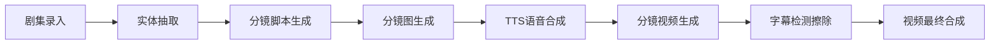

# ⛓️ 工作流概览与编排逻辑

PICPLOT 项目使用 **NexusFlow** 工作流引擎来编排复杂的 AI 生产链路。整个生产过程被划分为多个独立但互相关联的子工作流。

## 主业务链路

## 核心设计模式
1.  **异步化 (Asynchronous)**: 所有耗时较长的 AI 调用（生图、生视频、合成）均通过 `tb_task` 记录状态，由后台 Scheduler 异步拉取并执行。
2.  **状态驱动 (State-Driven)**: 每一阶段完成后，都会更新 `tb_episode` 的 `stat` 字段。
3.  **多合一/一变多 (Map-Reduce)**:
    *   **一变多**: 将一个剧集展开为多个分镜图片生成任务。
    *   **多合一**: 将所有分镜的视频片段合成为最终成片。

## 工作流文件清单
| 阶段 | 文件路径 | 说明 |
| :--- | :--- | :--- |
| 剧集录入 | `src/app/workflow/submit_episodes_workflow.py` | 数据初始化与合法性校验 |
| 实体抽取 | `src/app/workflow/novel_entity_workflow.py` | 提取角色一致性素材 |
| 分镜脚本 | `src/app/workflow/shot_script_workflow.py` | LLM 切割文案并生成提示词 |
| 分镜图 | `src/app/workflow/shot_pic_workflow.py` | 图像生成与 VL 自动评测 |
| TTS | `src/app/workflow/tts_workflow.py` | 角色音色分配与配音生成 |
| 分镜视频 | `src/app/workflow/shot_video_workflow.py` | 多模态视频生成 |
| 字幕擦除 | `src/app/workflow/subtitle_erase_workflow.py` | 后期背景处理 |
| 视频合成 | `src/app/workflow/re_video_workflow.py` | 阿里云 ICE 最终渲染 |