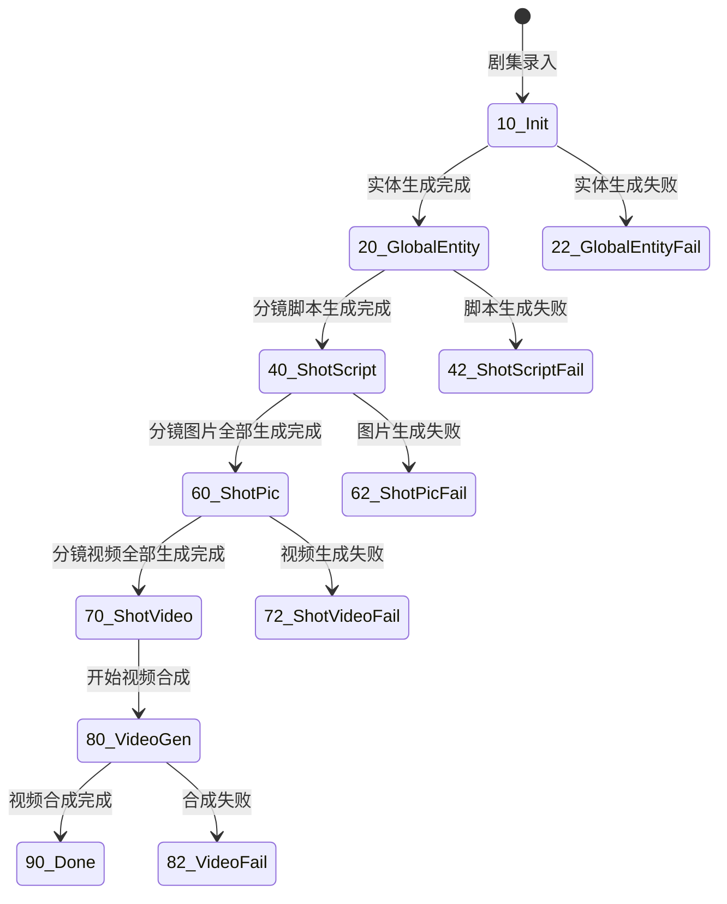

# 📊 Episode 状态机与流转逻辑

`tb_episode` 的 `stat` 字段是驱动整个系统自动流转的“齿轮”。了解状态变更时机对于排查卡死问题至关重要。

## EpisodeStatEnum 状态流转图

## 关键字段说明
- **stat (int)**: 主状态码，由各个 Workflow 执行节点更新。
- **tts_stat (int)**: 独立控制 TTS 流程的状态（0-处理中, 1-已完成）。
- **subtitle_erase_stat (int)**: (新增) 控制字幕擦除进度的状态。

## 任务重试逻辑
大部分状态变更都由 `tb_task` 的完成事件触发。如果 `stat` 停留在某个 Fail 状态，通常需要检查：
1.  `tb_task` 中是否有 `FAILED` 状态的任务。
2.  后端 Scheduler 是否正在轮询该状态对应的任务类型。